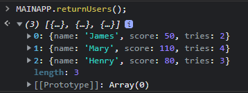

# Functional Programming

### 1. Functional Programming Introduction

- 문제를 해결하는 한 방법만 아는 사람은 여러 방법을 아는 사람보다 많은 불리함 속에 있다.

- 함수형 프로그래밍의 정의
  - Functional Programming is the process of building software by
    **composing pure functions**, **avoiding shared state**, **mutable data,**
    and **side-effects**. Functional Programming is **declarative** rather 
    than imperative, and application **state flows through pure functions.**
- **Functional Programming Concepts**
  - **Avoid**
    - Side Effects
    - Mutations
    - Shared State
  - **Use**
    - Pure Functions
    - Functions Composition
    - Declarative Code Instead of Imperative Code

### 2. Avoiding Side Effects and Using Pure Functions

ex-1)

```js
var MAINAPP = (function (nsp) {
  var currentUser = 0,
    users = [
      { name: "James", score: 30, tries: 1 },
      { name: "Mary", score: 110, tries: 4 },
      { name: "Henry", score: 80, tries: 3 },
    ];

  var updateScore = function (newAmt) {
    users[currentUser].score += newAmt;
  };

  var returnUsers = function () {
    return users;
  };

  var updateTries = function () {
    users[currentUser].tries++;
  };

  var updateUser = function (newUser) {
    currentUser = newUser;
  };

  nsp.updateUser = updateUser;
  nsp.updateTries = updateTries;
  nsp.updateScore = updateScore;
  nsp.returnUsers = returnUsers;
  return nsp;
})(MAINAPP || {});

// 타이밍의 차이로 원하는 결과가 나오지 않음
// henry에 대해서 조작하길 원했으나, 제임스가 조작됨
setTimeout(function() {MAINAPP.updateUser(2);}, 300);
setTimeout(function() {MAINAPP.updateScore(20);}, 100);
setTimeout(function() {MAINAPP.updateTries();}, 200);
```



ex-2)

```js
let cnt = 0;

let increment = function() {
  cnt ++;
  return cnt;
};

// Side effect is an observable change
// outside the function, side effects
// create certain disadvantages.
// -> makes code more difficult to predict(예측)
// -> makes code hardr to debug(디버그)
// -> makes code more difficult to reason about(추론)
// 변수를 여러 함수에서 직접 변경하면 이런 부작용이 생김
```

바꿔보면?

```js
// side effect를 피하려면?
let increment = function(num) {
  return num + 1;
};

// 이런 함수를 순수함수라고 한다.


// 또 다른 순수함수
let average = function(scores) {
    var total = 0;
    for (let i = 0; i < scores.length; i++) {
        total += scores[i];
    }
    return total/scores.length;
};

average([90, 30, 40, 50, 60]);

// -> array를 직접 수정하지않고, 외부 데이터를 수정하지도 않음
// 영향을 받는 것들은 모두 함수 안에만 있다
// side effects를 제거함
```

- **What are the pure functions?**
  - The function depends on the input provided and not on external data that changes
    (제공된 인풋데이터에만 함수가 의존함, 외부 데이터 X)
  - The function doesn't cause side effects. It doesn't cause change beyond its scope
    (side effects 유발안함, 함수 스코프를 벗어나는 변화를 만들지 않음)
  - Given the same input, the function will always return the same output.
    (같은 input은 같은 output을 보장한다)
- **Side Effects**
  - Changing a value globally (variable, property or data structure)
    (전역적으로 변수를 변화시킴)
  - Changing the original value of a functions argument.
    (함수 argument의 original value를 변화시킴)
  - Throwing an exception
    (예외를 발생시킴)
  - Printing to the Screen or Logging
  - Triggering an external process.
  - Invoking other functions that have side-effects.
- 사이드 이펙트가 완전히 피해야 할 것은 아니지만, 광범위해지면 큰 문제이고, 의존하면 안된다.
- pure function과 함께 side effects를 줄인다면 코드는 디버깅, 예측이 쉬워질 것

### 3. 실습 1

```js
var currentUser = 0,
     users = [{name: "James",score: 30,tries: 1}, {name: "Mary", score: 110,tries: 4}, {name: "Henry",score: 80,tries: 3}];

var updateScore = function(newAmt) {
    users[currentUser].score += newAmt;
};

var returnUsers = function() {
    return users;
};

var updateTries = function() {
    users[currentUser].tries++;
};

var updateUser = function(newUser) {
    currentUser = newUser;
};
```

- 위의 함수들을 pure 함수로 바꾸어라

```js
// *Solutions*

var users = [{name: "James",score: 30,tries: 1}, {name: "Mary", score: 110,tries: 4}, {name: "Henry",score: 80,tries: 3}];

// Mutable Functions
var recordData = function(arr, prop) {
  users.forEach(function(val, i, a) {
    if (val.name.toLowerCase() === arr[0].toLowerCase()) {
      a[i][prop] = arr[1];
    }
  });
};

// Pure Functions
var getScore = function(arr, name) {
  let score;

  for (let i = 0; i < arr.length; i++) {
    if (arr[i].name.toLowerCase() === name.toLowerCase()) {
      score = arr[i].score;
      break;
    }
  };
  return [name, score];
};

var getTries = function(arr, name) {
  let tries;

  for (let i = 0; i < arr.length; i++) {
    if (arr[i].name.toLowerCase() === name.toLowerCase()) {
      tries = arr[i].tries;
      break;
    }
  };
  return [name, tries];
};

var updateScore = function(arr, amt) {
    let newAmt = arr[1] + amt;
    return [arr[0], newAmt]
};

var updateTries = function(arr) {
  let newTries = arr[1] + 1;
  return [arr[0], newTries];
};

let newScore = updateScore(getScore(users, "Henry"), 30);
recordData(newScore, "score");
recordData(updateTries(getTries(users, "Henry")), "tries");
```

### 4. 실습 2

```js
var users = [{name: "James",score: 30,tries: 1}, {name: "Mary", score: 110,tries: 4}, {name: "Henry",score: 80,tries: 3}];

var newScore = function(arr, name, amt) {
    arr.forEach(function(val) {
        if (val.name.toLowerCase() === name.toLowerCase()) {
            val.score = val.score + amt;
        }
    });
    return arr;
};

var newTries = function(arr, name) {
    arr.forEach(function(val) {
        if (val.name.toLowerCase() === name.toLowerCase()) {
            val.tries++;
        }
    });
    return arr;
};

// 참조하는 객체까지 변해버림
// 참조로 전달하는 것은 위험함
var newArray1 = newScore(users, "Henry", 30);
var newArray2 = newTries(users, "Henry");
```

```js

var users = [{name: "James",score: 30,tries: 1}, {name: "Mary", score: 110,tries: 4}, {name: "Henry",score: 80,tries: 3}];

//Modifies Data
var storeUser = function(arr, user) {
    for (let i = 0; i < arr.length; i++) {
        if (arr[i].name.toLowerCase() === user.name.toLowerCase()) {
            arr[i] = user;
            break;
        }
    }
};

//Pure Functions
var getUser = function(arr, name) {
    for (let i = 0; i < arr.length; i++) {
        if (arr[i].name.toLowerCase() === name.toLowerCase()) {
            return arr[i];
        }
    }
    return null;
};

var updateScore = function(user, newAmt) {
    if (user) {
        user.score += newAmt;
        return user;
    }
};

var updateTries = function(user) {
    if (user) {
        user.tries++;
        return user;
    }
};

// 얘들도 마찬가지로 같은 객체 참조함
// side 이펙트의 전형적인 예
let usr = getUser(users, "Henry");
let usr1 = updateScore(usr, 30);
let usr2 = updateTries(usr1);
storeUser(users, usr2);
```

-> 이것을 해결하는 방법은 다음 챕터에서 배운다