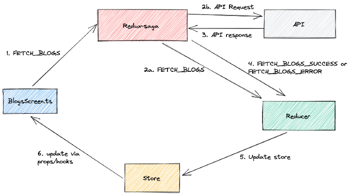

# 사가 활용법

- redux saga를 너무 한 가지 방법으로만 사용하는 것 같아 다양한 사용법을 알아놓기 위해 
  만든 문서
- github에 saga를 사용한 프로젝트를 참조하면서 정리
- 참고
  - https://alaminsahed.medium.com/redux-saga-with-example-react-9a5dbe82582a

### SAGA 동작 그림

- 

### some effects of Redux-sage

- **select**: **returns** the full **state** of the application
- **put: dispatch an action** into the store
- **call**: **run** something
- **cancel**: **cancels** the saga execution
- **fork**: **run** multiple sagas **parallelly**
- **all**:  run multiple Effects in parallel and **wait for all of them to complete**
- **takeEvery**: take every matching action and runs the given saga
- **takeLatest**: takes every matching action and runs the given sage, **but cancels every**
  **previous saga that is still running**

#### Setup

- Watcher Saga: **Watcher Saga observes all dispatched actions**. If any match, then it assigns this to the worker Saga.

### how redux-saga works