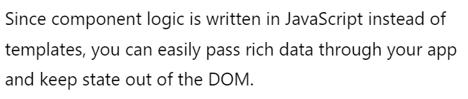

# Virtual DOM(가상 돔)

- DOM - 웹사이트의 청사진으로 생각할 수 있음, 페이지에 만들어지는 모든 변화를 업데이트 함
  만약에 갤러리에 한 사진은 지우면, 전체 갤러리를 렌더링한다. 이것은 한 사이트가 여러번 새로고침될 수 있는 것을 의미. 특히 SPA에서 각각의 새로고침과 리렌더링은 메모리를 잡아먹고 작은 변화를 위해 전체를 새로고침하는 것을 비효율 적이다. 

  - 이것이 Virtual DOM이 나온 배경이다.

-  Virtual DOM 이란?

  - React에서 개발된 것은 아니지만 리액트 소개 페이지의 정의를 보면
  - 

  - virtual dom은 DOM이 보고 업데이트 하기 전에 웹 페이지의 어떤 변화를 receive하는  lightweight 레이어입니다. 
  - 자바스크립트 객체의 형태를 취하면, virtual dom은 변화를 수신하고, 새로운 버전을 생성할 수 있습니다. 하지만 실제 페이지에서 어떤 것을 업데이트 하지 않는다면 더 적은 처리 능력이 필요합니다.
  - 이런한 시스템은 두 가지 버전의 Virtual DOM을 유지합니다. 하나는 하나는 변경되기 이전의 상태를 나타내고, 다른 하나는 업데이트된 상태를 나타냅니다. 이 두 상태 사이의 비교가 되면, 변경된 아이템은 렌더링을 위해 DOM에 전달됩니다.

- 실제로 어떻게 작동할까요?

  - 이 모든 작동은 뒤에서 이뤄지기 때문에, 너는 아마도 Virtual Dom을 보거나 상호작용하지 못합니다.
  - 필터로서 작용하는 Virtual DOM의 실용적인 측면을 생각하면, 처리능력을 아끼고, 웹사이트 속도를 올릴 수 있습니다.
  - Process는 다음과 같이 진행됩니다
    1. 사이트에 변화가 만들어진다.
       (A Change is made to the site)
    2. 전체 Virtual DOM이 업데이트 된다.
       (no changes are made tot the webpage at this stage)
    3. 업데이트된 virtual dom과 이전상태를 비교하고, 리액트는 바뀐 객체를 확인합니다.
       (The updated virtual DOM gets compared to its previous state. React then figures out which objects have changed)
    4. 바뀐 객체에 대해서만, RealDOM이 업데이트 됩니다.
    5. realDOM에 바뀐 변화는 스크린의 변화를 유발하고, 새로운 상태로 업데이트 됩니다.

- 요약

  - Virtual DOM은 비록 추상적인 개념이지만 리액트를 강력하게 하는 것입니다. 페이지가 업데이트될 때 렌더링되는 내용을 제한하는 것은 웹사이트가 더욱 더 효과적으로 작동하게 합니다.