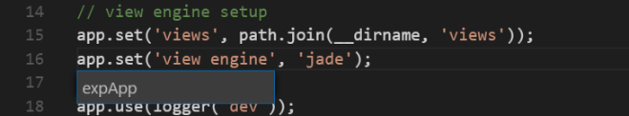

# Why Use TypeScript

#### 쓰기 전에 걱정하는 사항들

- 새로운 개발자들의 교육시간이 늘어남
- 복잡한 유지보수
- 리액트와의 많은 충돌이 예상됨
- 개발 시간의 증가
- JS만 잘하는 사람의 영입을 막음
- non-TS 코드 기반의 코드를 가져오기 힘듬

- 위의 사항들은 다 타입스크립트가 해결해줌

#### 타입스크립트 장점

- 코드가 이해하기 쉬워진다.
  - 보통 코드를 이해하기 위해서는
    - 어떤 argument가 허용되는가
    - 어떤 value가 return 되는가
    - 어떤 외부 데이터가 요구되는가
    - return value를 만들기 위해 어떤 작업을 해야하는가
  - JS와 같은 동적타입언어에서는 위의 4가지중 처음 3가지 질문에 대답하기가
    힘듬, 만약 함수가 `articles` argument를 받는다면, 이것이 객체인가? /
    이 안에 어떤 attribute가 있는가? 항상 같은 형태로 있는 것도 보장할 수 없음
     -> 정확히 예상하기 힘듬
  - 보통은 `console.log(article)`를 찍어보고 읽거나 / 함수가 사용되는 위치에
    가서 어떤 값이 입력되는가를 봐야함 / 동료에게 물어본다 / 한 번 예상해본다 /
    같은 방법으로 해결한다
  - 하지만 TS를 사용한다면 IDE와 compiler로 부터 즉각 3가지 질문에 대한 답을
    얻을 수 있다.
- 코드가 쉬워지고 수행이 빨라진다
  - 다음은 새로운 기능이나 새로운 컴포넌트를 만들 때 일반적인 워크플로우다
    - 컴포넌트 함수를 부트스트랩하고, 생성자 argument를 구성, 나머지코드 작성
    - 외부 데이터가 필요하다면, 해당 데이터가 어떻게 생긴지 기억하고 사용함
    - 컴포넌트를 app에 넣고 props를 통과시킴
    - 테스트 해봄
    - 테스트가 실패하면 다시 돌아가서 수행함
  - 타입스크립트에서는?
    - 컴포넌트함수 부트스트랩, 타입 정의, 수행
    - 만약의 외부함수가 필요하면 그것의 interface를 살펴본다
    - 컴포넌는 app에 넣고 props 통과
    - 타입에 대한 테스트는 필요없음(컴파일에 걸러짐), 로직에 대한 테스트만 하면됨
  - 따라서 TS를 쓰면 more readable, less error-prone
- 코드를 리팩토링하기 쉽다
  - TS에서는 여러 곳에서 쓰이고 있는 변수를 클릭 한 번에 바꿀 수 있다.
  - 
  - 동적타입언어에서는 Search & Replace가 필요하지만, TS에서는 Find All Occurrences, Rename Symbol 같은 명령어를 사용하면 된다.
  - TS는 바꾸려는 대상이 사용되는 곳을 모두 찾아서 리팩토링, 리네임 해줄 것이다. 그리고 만약에 리팩토링 후에 타입 미스매치가 생기면 컴파일 에러로 알려줄 것임
- Less bugs
- Less boilerplate tests
  - 너가 변수들을 정확히 필요한 곳에 투입시켰다면, 더 이상 그것에 대해 테스트 할 필요가 없다.
  - 귀찮게 보일러플레이트 unit/integration test 코드를 짜는 것보다, 너는 비즈니스 로직을 테스트하는데 집중할 수 있다. 
  - 개발시간에 단축, 더 적은 코드, 더 낮은 복잡성, 에러 확률 적음
- 코드를 merge하기 쉽다
  - 타입스크립트는 타입관련 테스트코드를 작성할 필요가 없어 PR을 승인하는 사람이 그 부분에 대해서는 확인할 필요가 없고, 신뢰할 수 있는 방법이 된다.
- 정확한 workflow를 가지게 개발자를 도움
  - TS를 쓰다보면 처음에 입력 데이터의 타입을 생각하고, 출력 데이터의 타입을 생각하게 된다. 그 후에 실제 로직을 짜게 된다.
  - 로직 전에 어떤 데이터를 받고, 결과로 어떤 데이터를 출력할 지 생각하는지가 옳은 workflow이다.

#### 타입스크립트 단점

- 단점은 동적타입언어의 장점을 사용 못하는 것에서 온다
  - 추가적인 컴파일 스텝이 필요
  - 코드가 길어짐
  - 추가적인 타입 공부의 필요성
- 설정이 까다로움